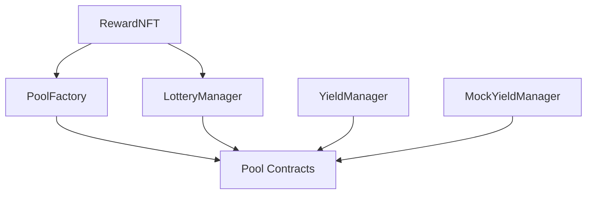

# Arisan+ Smart Contract Deployment Scripts

This directory contains comprehensive deployment scripts for the Arisan+ smart contract ecosystem.

## 📁 Available Scripts

### 1. `deploy-all-contracts.ts` - Complete Deployment
**Purpose**: Deploys all contracts with full configuration and permissions setup.

**Contracts deployed**:
- MockYieldManager (for testing)
- YieldManager (production yield management)
- RewardNFT (badge system)
- PoolFactory (pool creation and management)
- LotteryManager (lottery bonus system)

**Usage**:
```bash
# Local development
npm run deploy:all

# Sepolia testnet
npm run deploy:all:sepolia

# Mainnet (production)
npm run deploy:all:mainnet
```

### 2. `deploy-dev.ts` - Development Deployment
**Purpose**: Minimal deployment for development and testing.

**Contracts deployed**:
- MockYieldManager
- RewardNFT
- PoolFactory

**Usage**:
```bash
npm run deploy:dev
```

### 3. `deploy-production.ts` - Production Deployment
**Purpose**: Production-ready deployment with security checks.

**Features**:
- Network validation (prevents accidental local deployment)
- Balance verification
- Security delay before deployment
- Production-specific configurations

**Usage**:
```bash
npm run deploy:prod
```

### 4. `deploy-badge-integration.ts` - Badge System Focus
**Purpose**: Deploys contracts with emphasis on badge system integration.

**Usage**:
```bash
npm run deploy:badge
```

### 5. `deploy-single.ts` - Single Contract Deployment
**Purpose**: Deploy individual contracts for testing and development.

**Usage**:
```bash
# Deploy MockYieldManager
CONTRACT_NAME=MockYieldManager npm run deploy:single

# Deploy RewardNFT
CONTRACT_NAME=RewardNFT npm run deploy:single

# Deploy PoolFactory (requires BADGE_ADDRESS)
CONTRACT_NAME=PoolFactory BADGE_ADDRESS=0x123... npm run deploy:single
```

### 6. `deployment-utils.ts` - Deployment Management
**Purpose**: Utilities for managing and verifying deployments.

**Features**:
- Save deployment records
- Verify contract deployments
- Generate environment variables
- List deployment history

**Usage**:
```bash
# List all deployments
npm run deployment:list

# Verify a deployment
npm run deployment:verify deployment-31337-1234567890.json

# Generate .env variables
npm run deployment:env deployment-31337-1234567890.json .env.local
```

## 🔧 Configuration

### Environment Variables
Create a `.env` file in the contracts directory:

```env
# Network RPC URLs
SEPOLIA_RPC_URL=https://sepolia.infura.io/v3/YOUR_PROJECT_ID
MAINNET_RPC_URL=https://mainnet.infura.io/v3/YOUR_PROJECT_ID

# Private keys (never commit these!)
PRIVATE_KEY=your_private_key_here
SEPOLIA_PRIVATE_KEY=your_sepolia_private_key_here
MAINNET_PRIVATE_KEY=your_mainnet_private_key_here

# API keys for verification
ETHERSCAN_API_KEY=your_etherscan_api_key_here
```

### Network Configuration
The scripts support multiple networks configured in `hardhat.config.ts`:

- `localhost`: Local Hardhat network
- `sepolia`: Sepolia testnet
- `mainnet`: Ethereum mainnet

## 📋 Deployment Checklist

### Before Deployment
- [ ] Environment variables configured
- [ ] Sufficient ETH balance for gas fees
- [ ] Network configuration verified
- [ ] Contract compilation successful (`npm run build`)
- [ ] Tests passing (`npm run test`)

### After Deployment
- [ ] Contract verification on block explorer
- [ ] Save deployment addresses
- [ ] Update frontend configuration
- [ ] Set up monitoring and alerts
- [ ] Transfer admin roles to appropriate addresses

## 🛡️ Security Considerations

### Development
- Use `deploy-dev.ts` for local testing
- MockYieldManager provides predictable behavior
- All admin roles granted to deployer for easy testing

### Production
- Use `deploy-production.ts` for mainnet
- Includes security delays and validation
- Real YieldManager (not mock) deployed
- Consider multi-sig wallets for admin roles

## 📊 Contract Dependencies



## 🔍 Troubleshooting

### Common Issues

1. **Insufficient gas**: Increase gas limit in hardhat.config.ts
2. **Missing dependencies**: Ensure all contracts are compiled
3. **Permission errors**: Check role assignments in deployment scripts
4. **Network issues**: Verify RPC URLs and network connectivity

### Error Solutions

```bash
# Clean and rebuild
npm run clean
npm run build

# Check compilation
npx hardhat compile

# Test locally first
npm run node  # In terminal 1
npm run deploy:dev  # In terminal 2
```

## 📝 Example Deployment Flow

1. **Start local node**:
   ```bash
   npm run node
   ```

2. **Deploy contracts**:
   ```bash
   npm run deploy:all
   ```

3. **Verify deployment**:
   ```bash
   npm run deployment:list
   npm run deployment:verify <filename>
   ```

4. **Generate frontend config**:
   ```bash
   npm run deployment:env <filename> ../web/.env.local
   ```

5. **Run tests**:
   ```bash
   npm run test
   ```

## 📞 Support

For deployment issues or questions:
- Check the [main README](../README.md)
- Review contract documentation in [docs/](../docs/)
- Examine test files in [test/](../test/) for usage examples

---

*Generated by the Arisan+ deployment system*
