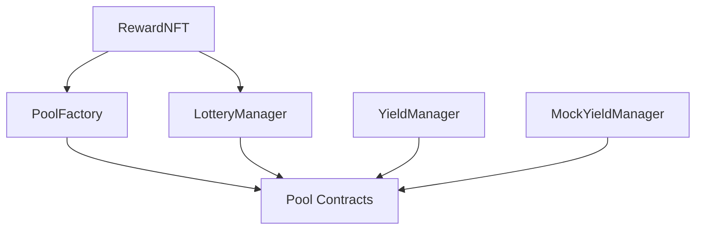

# Roca Smart Contract Deployment Scripts

This directory contains comprehensive deployment scripts for the Roca smart contract ecosystem.

## 📁 Available Scripts

### 1. `deploy-all-contracts.ts` - Complete Deployment
**Purpose**: Deploys all contracts with full configuration and permissions setup.

**Contracts deployed**:
- MockYieldManager (for testing)
- YieldManager (production yield management)
- RewardNFT (badge system)
- PoolFactory (pool creation and management)
- LotteryManager (lottery bonus system)

**Usage**:
```bash
# Local development
npm run deploy:all

# Sepolia testnet
npm run deploy:all:sepolia

# Mainnet (production)
npm run deploy:all:mainnet
```

### 2. `deploy-dev.ts` - Development Deployment
**Purpose**: Minimal deployment for development and testing with automatic web config update.

**Contracts deployed**:
- MockYieldManager
- RewardNFT  
- LotteryManager
- PoolFactory

**Features**:
- ✅ Automatic web config update
- ✅ Development permissions setup
- ✅ Contract verification
- ✅ Ready-to-use configuration

**Usage**:
```bash
# Standard deployment (manual config update)
npm run deploy:dev

# Automatic deployment with config update (recommended)
npm run deploy:dev:auto
# OR
./scripts/deploy-and-update.sh
```

**What happens**:
1. Deploys all development contracts
2. Sets up permissions and roles
3. Automatically updates `web/src/contracts/config.ts` with new addresses
4. Shows success confirmation with next steps

### 3. `deploy-somnia.ts` - Somnia Testnet Deployment
**Purpose**: Deploy core contracts (YieldManager and PoolFactory) to Somnia testnet.

**Contracts deployed**:
- YieldManager (real implementation, not Mock)
- PoolFactory

**Features**:
- ✅ Somnia testnet specific configuration
- ✅ Automatic web config update for chain ID 50311
- ✅ Deployment record saving
- ✅ Contract verification commands
- ✅ Network validation

**Usage**:
```bash
# Deploy to Somnia testnet
npx hardhat run scripts/deploy-somnia.ts --network somnia

# Or use the convenient shell script
./scripts/deploy-somnia.sh
```

**Requirements**:
- Set `PRIVATE_KEY` and `SOMNIA_RPC_URL` in your `.env` file
- Ensure deployer account has sufficient testnet ETH

### 4. `deploy-production.ts` - Production Deployment
**Purpose**: Production-ready deployment with security checks.

**Features**:
- Network validation (prevents accidental local deployment)
- Balance verification
- Security delay before deployment
- Production-specific configurations

**Usage**:
```bash
npm run deploy:prod
```

### 4. `deploy-badge-integration.ts` - Badge System Focus
**Purpose**: Deploys contracts with emphasis on badge system integration.

**Usage**:
```bash
npm run deploy:badge
```

### 5. `deploy-single.ts` - Single Contract Deployment
**Purpose**: Deploy individual contracts for testing and development.

**Usage**:
```bash
# Deploy MockYieldManager
CONTRACT_NAME=MockYieldManager npm run deploy:single

# Deploy RewardNFT
CONTRACT_NAME=RewardNFT npm run deploy:single

# Deploy PoolFactory (requires BADGE_ADDRESS)
CONTRACT_NAME=PoolFactory BADGE_ADDRESS=0x123... npm run deploy:single
```

### 6. `deployment-utils.ts` - Deployment Management
**Purpose**: Utilities for managing and verifying deployments.

**Features**:
- Save deployment records
- Verify contract deployments
- Generate environment variables
- List deployment history

**Usage**:
```bash
# List all deployments
npm run deployment:list

# Verify a deployment
npm run deployment:verify deployment-31337-1234567890.json

# Generate .env variables
npm run deployment:env deployment-31337-1234567890.json .env.local
```

## 🔧 Configuration

### Environment Variables
Create a `.env` file in the contracts directory:

```env
# Network RPC URLs
SEPOLIA_RPC_URL=https://sepolia.infura.io/v3/YOUR_PROJECT_ID
MAINNET_RPC_URL=https://mainnet.infura.io/v3/YOUR_PROJECT_ID

# Private keys (never commit these!)
PRIVATE_KEY=your_private_key_here
SEPOLIA_PRIVATE_KEY=your_sepolia_private_key_here
MAINNET_PRIVATE_KEY=your_mainnet_private_key_here

# API keys for verification
ETHERSCAN_API_KEY=your_etherscan_api_key_here
```

### Network Configuration
The scripts support multiple networks configured in `hardhat.config.ts`:

- `localhost`: Local Hardhat network
- `sepolia`: Sepolia testnet
- `mainnet`: Ethereum mainnet

## 📋 Deployment Checklist

### Before Deployment
- [ ] Environment variables configured
- [ ] Sufficient ETH balance for gas fees
- [ ] Network configuration verified
- [ ] Contract compilation successful (`npm run build`)
- [ ] Tests passing (`npm run test`)

### After Deployment
- [ ] Contract verification on block explorer
- [ ] Save deployment addresses
- [ ] Update frontend configuration
- [ ] Set up monitoring and alerts
- [ ] Transfer admin roles to appropriate addresses

## 🛡️ Security Considerations

### Development
- Use `deploy-dev.ts` for local testing
- MockYieldManager provides predictable behavior
- All admin roles granted to deployer for easy testing

### Production
- Use `deploy-production.ts` for mainnet
- Includes security delays and validation
- Real YieldManager (not mock) deployed
- Consider multi-sig wallets for admin roles

## 📊 Contract Dependencies



## � Automatic Web Config Update

### `update-web-config.ts` - Config Update Utility
**Purpose**: Automatically updates the web app's contract configuration with deployed addresses.

**Features**:
- ✅ Automatic address updates for any network
- ✅ Preserves existing config structure
- ✅ Supports all contract types
- ✅ CLI interface for manual updates

**Automatic Usage** (built into deploy-dev.ts):
```bash
# This automatically updates config
npm run deploy:dev
```

**Manual Usage**:
```bash
# Update specific addresses
npx ts-node scripts/update-web-config.ts \
  --chain 31337 \
  --pool-factory 0x123... \
  --reward-nft 0x456... \
  --lottery-manager 0x789... \
  --yield-manager 0xabc...

# Update for different networks
npx ts-node scripts/update-web-config.ts \
  --chain 11155111 \
  --pool-factory 0x123...
```

### `deploy-and-update.sh` - One-Click Deployment
**Purpose**: Complete deployment with automatic config update and validation.

**Features**:
- ✅ Checks if Hardhat node is running
- ✅ Deploys all contracts
- ✅ Updates web configuration
- ✅ Provides next steps

**Usage**:
```bash
# One-click deployment
./scripts/deploy-and-update.sh
# OR
npm run deploy:dev:auto
```

**What it does**:
1. Validates Hardhat node is running
2. Runs deployment script
3. Updates web config automatically
4. Shows success message with next steps

### Config File Location
The web configuration is automatically updated at:
```
web/src/contracts/config.ts
```

**Structure**:
```typescript
export const CONTRACT_ADDRESSES = {
  31337: {  // Hardhat localhost
    poolFactory: '0x...' as Address,
    badge: '0x...' as Address,
    lotteryManager: '0x...' as Address,
    yieldManager: '0x...' as Address,
    rewardNFT: '0x...' as Address,
  },
  11155111: { // Sepolia
    // ... addresses for testnet
  },
  1: { // Mainnet
    // ... addresses for production
  }
}
```

## �🔍 Troubleshooting

### Common Issues

1. **Insufficient gas**: Increase gas limit in hardhat.config.ts
2. **Missing dependencies**: Ensure all contracts are compiled
3. **Permission errors**: Check role assignments in deployment scripts
4. **Network issues**: Verify RPC URLs and network connectivity

### Error Solutions

```bash
# Clean and rebuild
npm run clean
npm run build

# Check compilation
npx hardhat compile

# Test locally first
npm run node  # In terminal 1
npm run deploy:dev  # In terminal 2
```

## 📝 Example Deployment Flow

1. **Start local node**:
   ```bash
   npm run node
   ```

2. **Deploy contracts**:
   ```bash
   npm run deploy:all
   ```

3. **Verify deployment**:
   ```bash
   npm run deployment:list
   npm run deployment:verify <filename>
   ```

4. **Generate frontend config**:
   ```bash
   npm run deployment:env <filename> ../web/.env.local
   ```

5. **Run tests**:
   ```bash
   npm run test
   ```

## 📞 Support

For deployment issues or questions:
- Check the [main README](../README.md)
- Review contract documentation in [docs/](../docs/)
- Examine test files in [test/](../test/) for usage examples

---

*Generated by the Roca deployment system*
