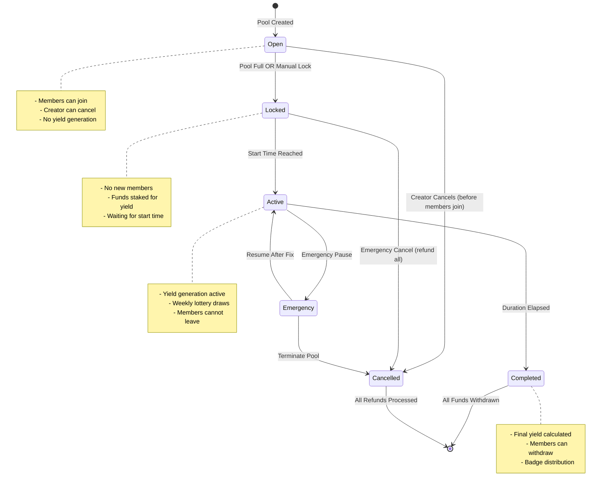

# Pool Lifecycle State Machine

## Overview

This document defines the state machine for the Arisan+ pool lifecycle, detailing the valid states, transitions, and rules governing pool behavior throughout its lifetime.

## State Diagram

## State Definitions

### 1. Open State
**Description**: Pool is accepting new members and collecting contributions.

**Characteristics**:
- Pool has been created but not yet locked
- Members can join by depositing the exact contribution amount
- Creator can modify certain parameters (if no members have joined)
- No yield generation occurs

### 2. Locked State
**Description**: Pool is full or manually locked, preparing for active yield generation.

**Characteristics**:
- No new members can join
- Existing members cannot leave
- Funds are staked in yield-generating protocols
- Pool waits for the predetermined start time
- Initial setup for lottery system occurs

### 3. Active State
**Description**: Pool is actively generating yield and conducting lottery draws.

**Characteristics**:
- Yield generation is active through DeFi protocols
- Weekly lottery draws occur for bonus distribution
- Member actions are limited to viewing status
- Pool duration countdown is active

### 4. Completed State
**Description**: Pool duration has ended, final calculations complete.

**Characteristics**:
- Final yield calculations are performed
- Members can withdraw their principal + yield share
- Achievement badges are distributed
- Pool becomes read-only after all withdrawals

### 5. Emergency State
**Description**: Pool operations are paused due to technical issues or security concerns.

**Characteristics**:
- All yield generation is halted
- No lottery draws occur
- Members cannot perform actions
- Only admin functions are available

### 6. Cancelled State
**Description**: Pool has been terminated before completion.

**Characteristics**:
- All members receive full refunds
- No yield distribution occurs
- Pool becomes permanently inactive

## Transition Rules Table

| From State | To State | Condition/Trigger | Who Can Initiate | Actions Allowed Before Transition |
|------------|----------|-------------------|------------------|-----------------------------------|
| [*] | Open | Pool creation successful | Pool Creator | Set pool parameters, deposit creator stake |
| Open | Locked | Pool reaches max members OR creator manually locks | System OR Creator | Join pool, leave pool (members), cancel pool (creator) |
| Open | Cancelled | Creator cancels empty pool | Pool Creator | Cancel pool (only if no members joined) |
| Locked | Active | Predetermined start time reached | System (automated) | View pool status, stake funds in yield protocols |
| Locked | Cancelled | Emergency cancellation triggered | Admin/Emergency Role | Prepare for refunds, unstake any staked funds |
| Active | Completed | Pool duration fully elapsed | System (automated) | Generate yield, conduct lottery draws, accumulate rewards |
| Active | Emergency | Critical issue detected | Admin/Emergency Role | Normal pool operations, yield generation, lottery draws |
| Emergency | Active | Issue resolved and pool resumed | Admin/Emergency Role | Emergency diagnostics, fund protection |
| Emergency | Cancelled | Issue cannot be resolved | Admin/Emergency Role | Emergency diagnostics, prepare termination |
| Completed | [*] | All members have withdrawn funds | System | Withdraw funds, claim badges, view final statistics |
| Cancelled | [*] | All refunds processed successfully | System | Process refunds, cleanup pool data |

## State-Specific Action Matrix

| State | Join Pool | Leave Pool | Withdraw Funds | Cancel Pool | Generate Yield | Lottery Draw | View Status |
|-------|-----------|------------|----------------|-------------|----------------|--------------|-------------|
| Open | ✅ | ✅ | ❌ | ✅ (Creator) | ❌ | ❌ | ✅ |
| Locked | ❌ | ❌ | ❌ | ❌ | 🔄 (Setup) | ❌ | ✅ |
| Active | ❌ | ❌ | ❌ | ❌ | ✅ | ✅ | ✅ |
| Completed | ❌ | ❌ | ✅ | ❌ | ❌ | ❌ | ✅ |
| Emergency | ❌ | ❌ | ❌ | ❌ | ❌ | ❌ | ✅ (Limited) |
| Cancelled | ❌ | ❌ | 🔄 (Refund) | ❌ | ❌ | ❌ | ✅ (Limited) |

**Legend**:
- ✅ = Action allowed
- ❌ = Action not allowed
- 🔄 = Special handling/automated process

## Invalid Transitions

The following state transitions are **NOT ALLOWED** and should be blocked by the smart contract:

| From State | To State | Reason |
|------------|----------|---------|
| Open | Active | Must go through Locked state for proper setup |
| Open | Completed | Cannot complete without being active |
| Locked | Completed | Must be active for the full duration |
| Active | Open | Cannot revert to accepting new members |
| Completed | Any | Final state except for cleanup |
| Cancelled | Any | Terminal state except for cleanup |

## Edge Cases and Error Handling

### 1. Insufficient Members at Lock Time
- **Scenario**: Pool is manually locked with fewer than minimum required members
- **Handling**: Transition to Cancelled state, process refunds

### 2. Yield Protocol Failure During Active State
- **Scenario**: External DeFi protocol fails or is compromised
- **Handling**: Transition to Emergency state, protect remaining funds

### 3. Network Congestion at Transition Time
- **Scenario**: Blockchain congestion prevents timely state transitions
- **Handling**: Grace period buffer, allow manual triggering by admin

### 4. Member Withdrawal Failure in Completed State
- **Scenario**: Technical issues prevent member from withdrawing
- **Handling**: Admin can trigger withdrawal on behalf of member

## Security Considerations

1. **State Transition Validation**: All transitions must be validated by smart contract logic
2. **Reentrancy Protection**: State changes must be protected against reentrancy attacks
3. **Access Control**: Only authorized entities can trigger manual transitions
4. **Emergency Mechanisms**: Admin must have ability to pause and protect funds
5. **Immutable History**: State transition history must be permanently recorded

## Implementation Notes

1. **Time-Based Transitions**: Use block timestamps with appropriate buffers for network delays
2. **Event Emissions**: Each state transition should emit comprehensive events for frontend tracking
3. **Gas Optimization**: Batch state-dependent operations where possible
4. **Upgradability**: Consider proxy patterns for future state machine improvements

## Testing Requirements

Each state transition should be tested with:
- Valid condition scenarios
- Invalid condition attempts
- Edge case handling
- Gas limit considerations
- Event emission verification
- Security attack vectors

---

*This state machine design ensures robust pool lifecycle management while maintaining security and user experience throughout the Arisan+ platform.*
